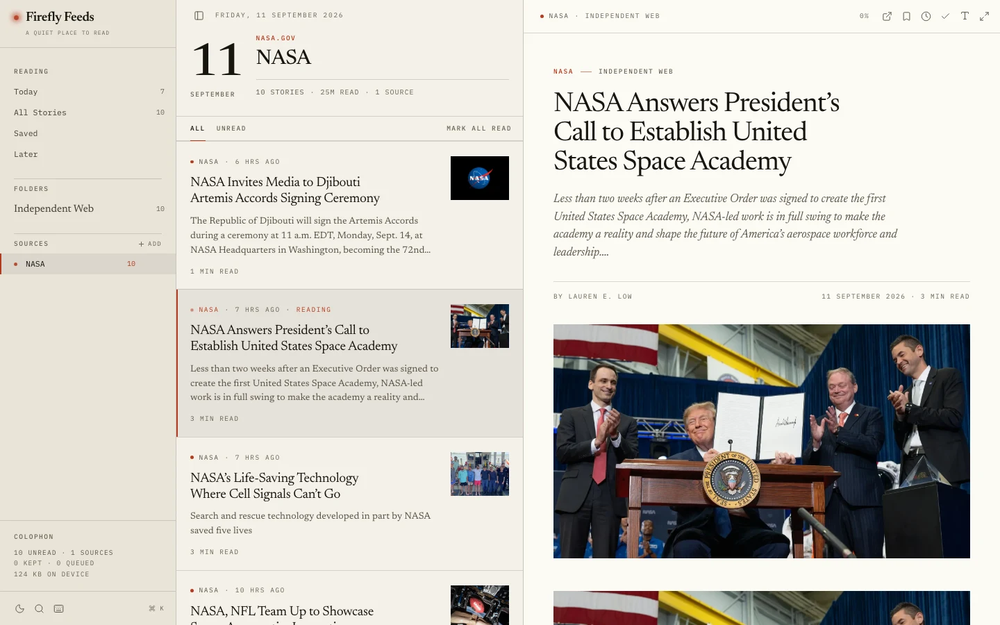

# Firefly Feeds

**Not a dashboard. A weekly publication that happens to know your subscriptions.**

Firefly Feeds is an editorial RSS reader for thoughtful, unhurried reading. It
fetches real feeds, parses them on the server, and shapes them into something
closer to a printed edition than an endless stream of rows.

The interface is designed around rhythm, hierarchy, and long-form attention — not
constant refreshing or infinite scrolling.

Everything you read, save, or queue stays on your device. There is no account, no
sync service, and no reading history stored on our servers.




_The same edition, light and dark. Screenshots are captured from the running app
reading a real feed — NASA's, because its imagery is public domain._

## Features

- **RSS 2.0, Atom and RDF** — normalised into one shape
- **Feed discovery** — paste any site address and it finds the feed
- **An editorial stream** — story layouts chosen by content, never by position
- **A reader, not a panel** — 600px measure, four text sizes, optical sizing
- **Read, save, read later** — the unread count is a queue, not a log
- **Read on reaching the end** — not on clicking
- **Keyboard-first** — press `?` for the whole set
- **Search** across every source, author and headline
- **Dark mode**, and an immersive reading mode
- **Local-first storage** — IndexedDB, no account, no sync service
- **Open the original** in a new tab, from the stream or the reader
- **A sample edition** on first run, so there is something to look at

## Why it is not like the others

**It reads like a publication.** Three paper tones separated by hairlines instead
of cards; a serif for every headline and all reading text, mono for everything
that is metadata; one accent colour, used only where it means something.

**It gives each story the room it earns.** A story with a picture gets a
thumbnail row; one with nothing to summarise gets a bare contents-page line;
everything else gets a headline and a standfirst. Never a coin-flip, never a
shape that hides a summary you could have used.

**It treats "read" as something you did.** Opening a story is not reading it.
Reaching the end is — and so is staying with a short one. Nothing you meant to
glance at disappears from the queue.

**It never makes anything up.** The only invented content is the sample edition,
which is fenced off, labelled, carries no outbound links, and retires itself the
moment you subscribe to something real.

## Running locally

Requires [Bun](https://bun.sh). No other setup, no environment variables.

```bash
bun install
bun run dev      # development server
bun run build    # production build
bun run start    # production server
```

The quality gate:

|                 |                                                   |
| --------------- | ------------------------------------------------- |
| `bun run good`  | format, lint, typecheck, test                     |
| `bun run check` | the same plus a production build, writing nothing |

## How it works

**Feeds are read on the server.** `app/api/feed/route.ts` is the only thing that
touches the network, so publishers never need CORS headers and the page makes no
third-party requests until you subscribe to something.

**Bodies become blocks, not HTML.** Feed HTML is translated into the reader's own
block model — paragraphs, headings, quotes, lists, figures. No
`dangerouslySetInnerHTML`, no sanitiser dependency, and no publisher stylesheet
leaking into the reading surface.

**Read state is local, and shaped for replication.** Read, saved and later live
in IndexedDB behind a repository interface, with `updatedAt` on every record and
deletions kept as tombstones — so a sync client has something to work with later,
and a new device re-fetches prose rather than downloading a corpus.

**Fabricated content is fenced off.** The sample edition is invented all the way
down: invented publications on reserved `.example` hosts, invented bylines, no
outbound links. It is active only while you have subscribed to nothing, so
invented and real stories can never mix.

## Documentation

|                                              |                                                            |
| -------------------------------------------- | ---------------------------------------------------------- |
| [docs/DESIGN.md](docs/DESIGN.md)             | Why it looks like this — paper, type, rhythm, the firefly  |
| [docs/ARCHITECTURE.md](docs/ARCHITECTURE.md) | How a feed becomes a page, and where the seams are         |
| [docs/STORAGE.md](docs/STORAGE.md)           | The three stores, the repository contract, what sync needs |

Working on the code? [AGENTS.md](AGENTS.md) has the conventions, the layering
rules and the commands.

## Stack

[vinext](https://github.com/cloudflare/vinext) — the Next.js App Router on Vite 8
/ Rolldown — React 19, Tailwind CSS v4, lucide-react, Bun.

Fonts are self-hosted in `public/fonts`, so there is no font CDN in the request
path.

## License

FireflyFeeds is open source under the [MIT License](LICENSE).

The FireflyFeeds name, logo, visual identity, and other brand assets are not included in the MIT License. The license does not grant permission to use these assets to represent modified or derivative versions as official FireflyFeeds products.

Third-party fonts, images, and other assets remain subject to their respective licenses.

