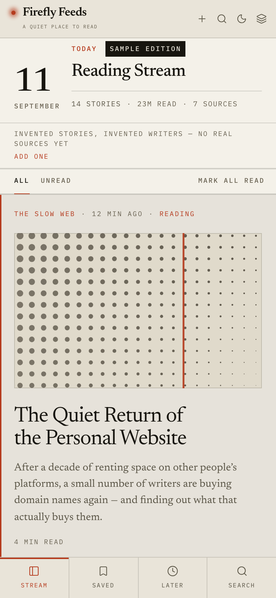

# Design

The visual language is not decoration; it is the product. This is what it is
made of, and why.

---

## Surface

Three paper tones, separated by 1px hairlines. No cards, no shadows on surfaces,
no gradients, no glass. The single exception is the popover, which needs a tight
shadow to lift it off the text underneath.

| Token    | Light     | Dark      | Role                  |
| -------- | --------- | --------- | --------------------- |
| `canvas` | `#e9e4d9` | `#0b0a09` | navigation and chrome |
| `stream` | `#f4f1e9` | `#131210` | the story column      |
| `reader` | `#fcfaf5` | `#1b1a17` | the reading surface   |

The differences are small on purpose. Stacked paper, not three panels.

## Ink

`ink` → `ink2` → `ink3` → `ink4`, calibrated so **every tier clears 4.5:1
against the darkest paper tone** — including 9.5px mono captions, which is where
a ramp usually fails. Any new colour has to clear it too.

The accent is one colour, used sparingly: unread markers, the active row's edge,
the article end mark. It is never decorative.

## Type

Two families, each with one job.

**Newsreader** carries the entire editorial voice:

|                                     |     |
| ----------------------------------- | --- |
| the logotype                        | 600 |
| section titles, the edition date    | 500 |
| every headline and all reading text | 400 |

Its optical-size axis (`opsz`) draws a 20px masthead and 19px body text
differently, which is what lets one serif do both. **Weight is what a logotype
needs, not a third family** — a high-contrast display face set at 20px goes
hairline-thin, which is what display faces do at text sizes.

**IBM Plex Mono** is for anything that is metadata: navigation, kickers,
timestamps, counts, captions. Metadata is uppercase and widely tracked; reading
text never is.

Both are self-hosted from `public/fonts` as variable subsets and preloaded, so
there is no font CDN in the request path and the type renders identically
offline.

## Measure

Body text is held at **600px / about 62 characters**, and the reader offers four
steps from 17.5px to 23.5px. Long-form text gets a lede: the opening paragraph
is set slightly larger at full ink strength, which gives the piece a first beat
without the fragility of a drop cap.

## Rhythm

The stream does not render every story the same way — but **a row's shape is
earned by the story, never by its position in the feed.**

| Layout     | Use                                                   | Chosen by                          |
| ---------- | ----------------------------------------------------- | ---------------------------------- |
| `feature`  | one per edition — full-bleed plate, large headline    | authored                           |
| `standard` | headline, standfirst, 84px plate                      | the entry has a picture            |
| `compact`  | headline and a two-line standfirst                    | the default                        |
| `quote`    | a pull quote _is_ the story, behind a 2px accent rule | authored                           |
| `brief`    | contents-page row with a dotted leader                | the entry has nothing to summarise |

A positional rule would be arbitrary twice over: the same story would render
differently depending on when it was published, and a per-source "lead story"
would land at an arbitrary height in a merged, time-sorted column. Real rhythm
comes from the content — some entries have pictures, some have long standfirsts,
some have neither.

**A row may never hide a summary that exists.** A bare title reads as missing
data, not as a deliberate layout.

## Plates

The sample edition's illustrations are generated SVG, drawn deterministically
from the story id: halftone, arcs, stripes, bands, grid, hatch, horizon, numeral.

They belong to the sample edition and nothing else. A fetched article carries
artwork only when the publisher's feed supplied it; a plate in a photograph's
slot would read as the article's own image and would not exist on the page the
story links to.

## The firefly

One point of light. Not an illustration — a small accent dot with a soft halo,
reused as the unread marker, the logotype, the article end mark and the empty
state. It pulses slowly, and stops entirely under `prefers-reduced-motion`.

## Mobile

Mobile is not the desktop stack squashed. Below 1024px the structure changes:
a compact masthead, the stream at full width, a four-item tab bar, and **the
article as a full-screen sheet** with its own toolbar and a four-action bar at
the bottom. Navigation moves into a drawer.

Safe-area insets are honoured top and bottom, because a full-screen reading
surface is the one place a notch actually matters.

## Layout rule

Three columns need about **1320px** to hold a 600px measure. Below that the
navigation steps aside automatically — unless the reader has chosen a nav width
themselves, which is never overridden.

`app/globals.css` is the source of truth for all of the above.
